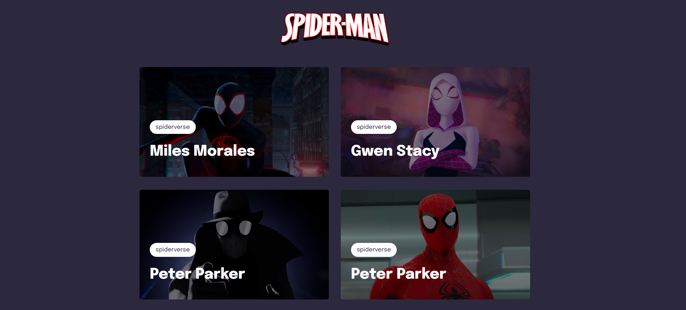

**<h1 align="center">Spiderverse**</h1>

Projeto responsivo aplicando alguns conhecimentos front-end.
 

### 💻 Preview

  

### 🚀 Tecnologias

Esse projeto foi desenvolvido com as seguintes tecnologias:

- HTML
- CSS

### 📚 Aprendizados

- Grid
- Animações
- Responsividade
- Variáveis css